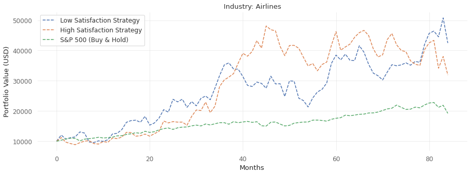

# asci_backtesting_analysis
This repository contains a Python script and a Jupyter notebook used to explore the relationship between consumer satisfaction scores and stock returns, using the American Customer Satisfaction Index (ASCI) scores for publicly traded companies from 2012 to 2019.

The script implements two trading strategies for each sector: a high satisfaction strategy, where at the beginning of each year, the strategy buys the stock in the sector with the highest consumer satisfaction score from the previous year, and a low satisfaction strategy, where at the beginning of each year, the strategy buys the stock in the sector with the lowest consumer satisfaction score. For each strategy in each sector, the script calculates various performance metrics, including overall returns over the 7-year period, annualized return, maximum drawdown, alpha, beta, and a Sharpe ratio.

The results are presented in a table that shows the performance of the two strategies for each sector, as well as the S&P 500 (buy and hold) returns over the same period. 




## Contents
The repository contains the following files:

- ```ASCI_Notebook.ipynb```: a Jupyter notebook that walks through the analysis and displays the results  
- ```ASCI_Scores.csv```: a CSV file containing the ASCI scores for publicly traded companies from 2012 to 2019, used by the script to compute the trading strategies and performance metrics  
- ```airline_returns.png```: example screenshot  
- ```README.md```: this file

## Requirements
To run the Jupyter notebook, the following packages need to be installed:

- pandas  
- numpy  
- matplotlib  
- scipy  
- FundamentalAnalysis  
- empyrical  
- quantstats  

## Usage
To use the script and the notebook, follow these steps:

1. Download the repository to your local machine  
2. Install the required packages
3. Open the ```ASCI_Notebook.ipynb``` notebook in Jupyter and run the cells  

The script will load the ASCI data from the  ```ASCI_Scores.csv``` file, compute the trading strategies and performance metrics, and display the results in the notebook.


## Results
| Sector | High Satisfaction (HS) 7-Year Return |  Low Satisfaction (LS) 7-Year Return |  S&P 500 (Buy & Hold) 7-Year Return | 
| :---:  | :---: | :---: | :---: |  
| Airlines | 319.01%   | 424.79%   | 192.21%   |
| Athletic Shoes | 520.99%   | 177.73%   | 192.21%   |
| Banks | 229.36%   | 320.39%   | 192.21%   |
| Consumer Shipping | 235.11%   | 103.06%   | 192.21%   |
| Department and Discount Stores | 125.03%   | 12.96%   | 192.21%   |
| Fixed-Line Telephone Service | 76.55%   | 154.32%   | 192.21%   |
| Health and Personal Care Stores | 4806.62%   | 104.61%   | 192.21%   |
| Household Appliances | 270.54%   | 109.67%   | 192.21%   |
| Internet Investment Services | 339.42%   | 350.8%   | 192.21%   |
| Internet Retail | 822.01%   | 256.26%   | 192.21%   |
| Life Insurance | 178.70%   | 123.32%   | 192.21%   |
| Limited-Service Restaurants | 206.30%   | 172.6%   | 192.21%   |
| Personal Care and Cleaning Products | 241.19%   | 137.12%   | 192.21%   |
| Property and Casualty Insurance | 207.40%   | 328.67%   | 192.21%   |
| Soft Drinks | 42.20%   | 169.29%   | 192.21%   |
| Specialty Retail Stores | 339.17%   | 819.30%   | 192.21%   |
| Supermarkets | 223.62%   | 152.57%   | 192.21%   |

